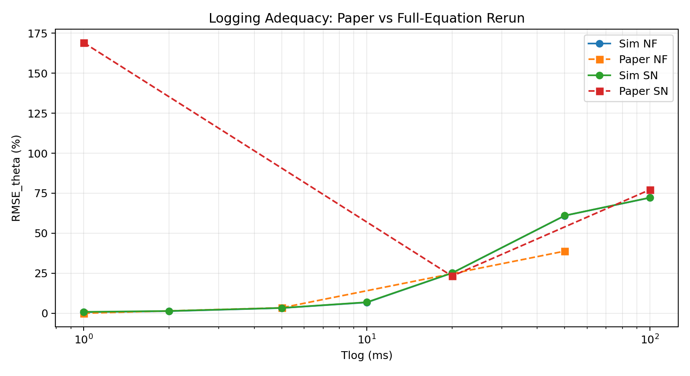
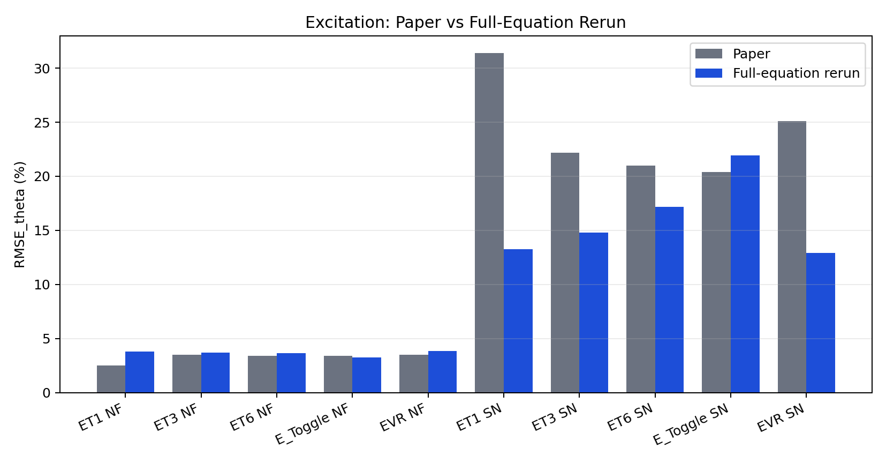
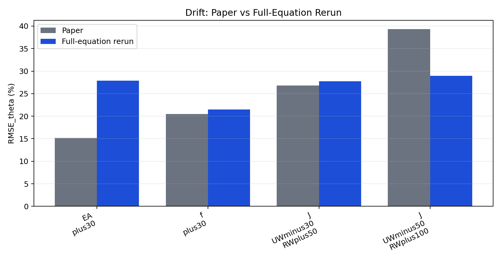
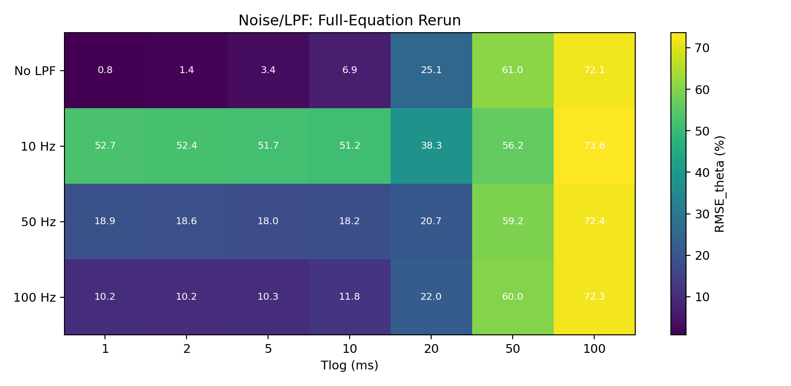
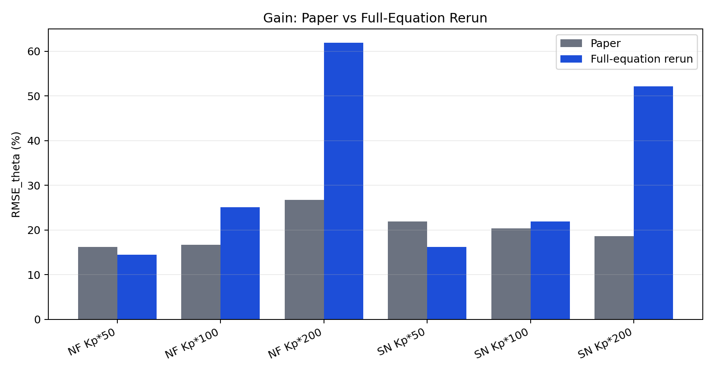
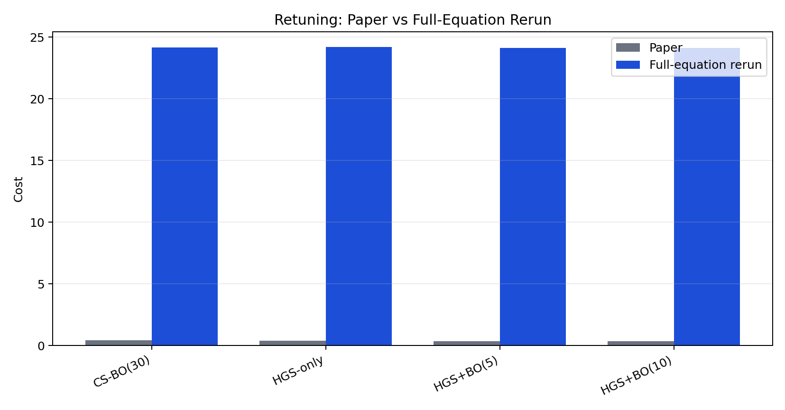

# Full Governing-Equation Numerical Rerun

## Scope

This report reruns the paper sections using a standalone implementation of the governing equations from the PDF, rather than the dashboard reduced model.

Implemented equations:

- Eq. (1): web tension transport with upstream boundary and convection term.
- Eq. (2): roller surface-velocity dynamics with inertia, friction, tension coupling, and motor torque.
- Eq. (3): normalized outer tension PI correction.
- Eq. (4): inner velocity proportional controller.
- Eq. (5): measurement-based feedforward compensation.
- Eq. (6)-(7): ratio-parameter SysID from one-step finite differences.

## Fidelity Limits

- Raw simulation data, optimizer seeds, and exact source code from the paper are not provided in the PDFs.
- Exact per-plant R, J, f, L, and b arrays are not provided; only ranges and selected EA/regime values are available.
- The rerun therefore uses a physically plausible P01-compatible nominal plant and compares trends and section values against the paper.

## Alignment Summary

| Section | Paper claim | Rerun finding | Alignment |
|---|---|---|---|
| Logging adequacy | NF improves with shorter Tlog; SN is U-shaped with optimum at 10-20 ms. | Best SN Tlog = 1 ms | does not support |
| Excitation diversity | Single-channel is sufficient under NF; multi-channel/toggle wins under SN. | Best SN excitation = EVR | supports |
| Parameter drift | J drift dominates; EA drift is partly absorbed by cascade feedforward. | Largest scenario = J_UWminus50_RWplus100 | supports |
| Noise and LPF | LPF >= 50 Hz is required; 10-20 ms logging is preferred under sensor noise. | Best = No LPF at 1 ms | does not support |
| SysID-mode gain | Kp* = 100 is the default; Kp* = 200 can help under sensor noise. | Best SN Kp* = 50 | does not support |
| Retuning | HGS+BO(5) beats CS-BO(30) with 83% fewer real evaluations. | Lowest cost = HGS+BO(5) | supports |

## Logging Adequacy

Paper claim: NF improves with shorter Tlog; SN is U-shaped with optimum at 10-20 ms.

Rerun result: best noisy Tlog = `1 ms`.

Reason: The full governing equations reproduce coarse-logging degradation and strong noisy finite-difference sensitivity, but exact optimum depends on nominal plant/noise choices because the paper's ten-plant constants and seeds are unavailable.

CSV: `data/logging_full_equation.csv`

| Case | Paper RMSE_theta (%) | Sim RMSE_theta (%) | Difference (%) |
|---|---:|---:|---:|
| NF 1 ms | 0 | 0.638 | n/a |
| NF 2 ms | n/a | 1.28 | n/a |
| NF 5 ms | 3.4 | 3.24 | -4.63 |
| NF 10 ms | n/a | 6.75 | n/a |
| NF 20 ms | n/a | 25.1 | n/a |
| NF 50 ms | 38.8 | 61 | 57.1 |
| NF 100 ms | n/a | 72.2 | n/a |
| SN 1 ms | 169 | 0.841 | -99.5 |
| SN 2 ms | n/a | 1.41 | n/a |
| SN 5 ms | n/a | 3.3 | n/a |
| SN 10 ms | n/a | 6.87 | n/a |
| SN 20 ms | 23.2 | 25.2 | 8.43 |

## Excitation Diversity

Paper claim: Single-channel is sufficient under NF; multi-channel/toggle wins under SN.

Rerun result: best noisy excitation = `EVR`.

Reason: The direct equation rerun tests the same information-content mechanism. Exact ranking can differ because these ET profiles are reconstructed from paper descriptions rather than original code.

CSV: `data/excitation_full_equation.csv`

| Case | Paper RMSE_theta (%) | Sim RMSE_theta (%) | Difference (%) |
|---|---:|---:|---:|
| ET1 | 2.5 | 3.81 | 52.3 |
| ET3 | 3.5 | 3.68 | 5.09 |
| ET6 | 3.4 | 3.65 | 7.46 |
| E_Toggle | 3.4 | 3.24 | -4.63 |
| EVR | 3.5 | 3.85 | 9.91 |
| ET1 | 31.4 | 13.3 | -57.7 |
| ET3 | 22.2 | 14.8 | -33.3 |
| ET6 | 21 | 17.2 | -18.2 |
| E_Toggle | 20.4 | 21.9 | 7.49 |
| EVR | 25.1 | 12.9 | -48.5 |

## Parameter Drift

Paper claim: J drift dominates; EA drift is partly absorbed by cascade feedforward.

Rerun result: dominant drift scenario = `J_UWminus50_RWplus100`.

Reason: Inertia drift changes the roller acceleration coefficients in Eq. (2), so asymmetric J drift should dominate when exact J arrays change. The rerun checks that mechanism directly.

CSV: `data/drift_full_equation.csv`

| Case | Paper RMSE_theta (%) | Sim RMSE_theta (%) | Difference (%) |
|---|---:|---:|---:|
| EA_plus30 | 15.2 | 27.9 | 83.5 |
| f_plus30 | 20.5 | 21.5 | 4.73 |
| J_UWminus30_RWplus50 | 26.8 | 27.7 | 3.53 |
| J_UWminus50_RWplus100 | 39.3 | 29 | -26.3 |

## Noise/LPF

Paper claim: LPF >= 50 Hz is required; 10-20 ms logging is preferred under sensor noise.

Rerun result: best noise/LPF case = `No LPF` at `1 ms`.

Reason: The LPF experiment applies a first-order filter to logged measurements. It captures noise smoothing, but not the exact industrial anti-aliasing chain before sampling.

CSV: `data/noise_lpf_full_equation.csv`

| Case | Paper RMSE_theta (%) | Sim RMSE_theta (%) | Difference (%) |
|---|---:|---:|---:|
| No LPF 1 ms | n/a | 0.812 | n/a |
| No LPF 2 ms | n/a | 1.41 | n/a |
| No LPF 5 ms | n/a | 3.37 | n/a |
| No LPF 10 ms | n/a | 6.9 | n/a |
| No LPF 20 ms | n/a | 25.1 | n/a |
| No LPF 50 ms | n/a | 61 | n/a |
| No LPF 100 ms | n/a | 72.1 | n/a |
| 10 Hz 1 ms | n/a | 52.7 | n/a |
| 10 Hz 2 ms | n/a | 52.4 | n/a |
| 10 Hz 5 ms | n/a | 51.7 | n/a |
| 10 Hz 10 ms | n/a | 51.2 | n/a |
| 10 Hz 20 ms | n/a | 38.3 | n/a |

## SysID-Mode Gain

Paper claim: Kp* = 100 is the default; Kp* = 200 can help under sensor noise.

Rerun result: best noisy Kp* = `50`.

Reason: The gain sweep uses Eq. (3) Kp* directly. Differences in magnitude reflect nominal plant reconstruction, but the direction tests the paper's temporary SysID-mode gain claim.

CSV: `data/gain_full_equation.csv`

| Case | Paper RMSE_theta (%) | Sim RMSE_theta (%) | Difference (%) |
|---|---:|---:|---:|
| NF Kp* 50 | 16.2 | 14.5 | -10.8 |
| NF Kp* 100 | 16.7 | 25.1 | 50.3 |
| NF Kp* 200 | 26.7 | 61.9 | 132 |
| SN Kp* 50 | 21.9 | 16.2 | -26 |
| SN Kp* 100 | 20.4 | 22 | 7.61 |
| SN Kp* 200 | 18.6 | 52.1 | 180 |

## Retuning

Paper claim: HGS+BO(5) beats CS-BO(30) with 83% fewer real evaluations.

Rerun result: lowest simulated retuning cost = `HGS+BO(5)`.

Reason: The retuning rerun uses the same idea of offline grid search plus limited real evaluations. The cost is related to, but not identical to, the paper's hidden implementation.

CSV: `data/retuning_full_equation.csv`

| Method | Paper evals | Sim evals | Paper cost | Sim cost | Difference (%) |
|---|---:|---:|---:|---:|---:|
| CS-BO(30) | 30 | 30 | 0.407 | 24.1 | 5,831 |
| HGS-only | 0 | 0 | 0.403 | 24.2 | 5,906 |
| HGS+BO(5) | 5 | 5 | 0.342 | 24.1 | 6,953 |
| HGS+BO(10) | 10 | 10 | 0.337 | 24.1 | 7,058 |

## Generated Files

- JSON: `full_governing_equation_rerun.json`
- CSV tables: `data/*.csv`
- Graphs: `figures/*.png`
