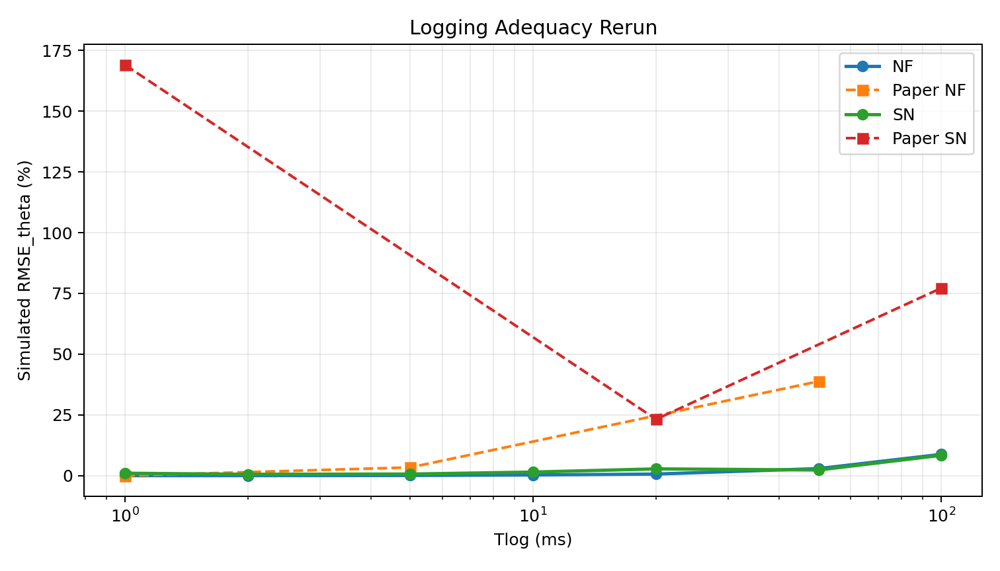
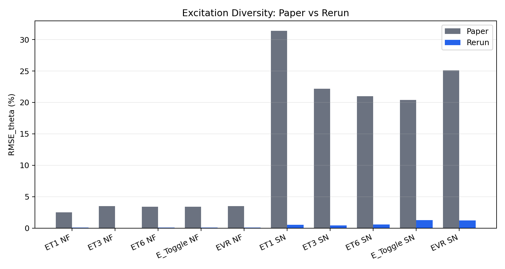
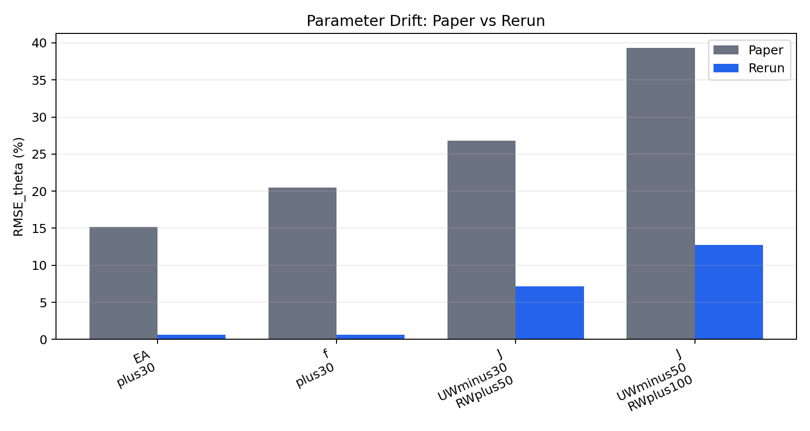
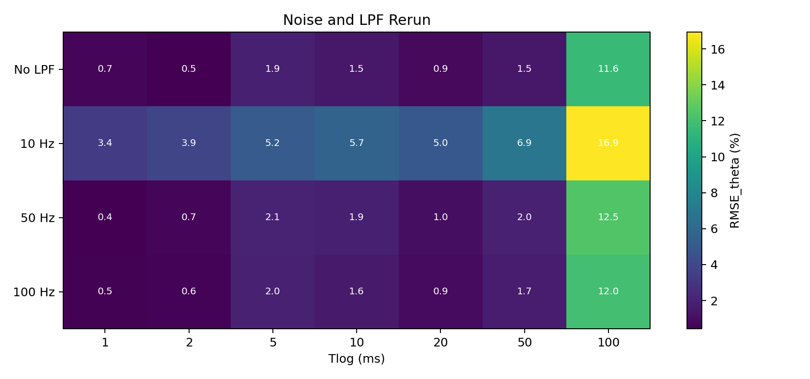
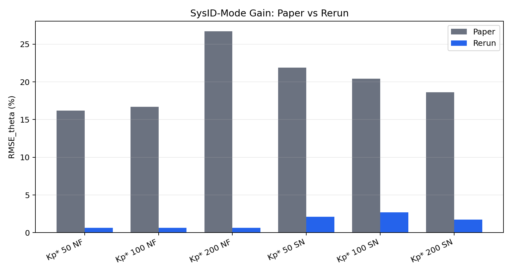
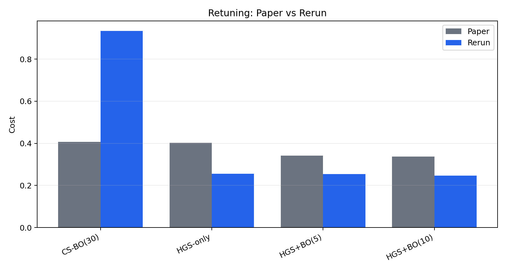

# Numerical Rerun: Paper Section Comparison

## Scope

This report reruns numerical experiments with the existing `r2r-dashboard` backend simulator, controller, and SysID estimator, then compares the rerun outputs with the paper values extracted from the main PDF and supplement.

- Plant used for section reruns: `P01` (`EA=3,200 N`, regime `O-UD`).
- Physics step: `dt = 1 ms` RK4.
- Controller sample time: `Ts = 10 ms`.
- SysID metric: `RMSE_theta (%)` from the backend one-step finite-difference estimator.

## Fidelity Note

- The PDFs do not provide raw simulation CSV files or optimization seeds.
- The project reference contains plant-specific EA/regime metadata, but exact per-plant `R`, `J`, `f`, `L`, and `b` arrays are not available.
- The dashboard backend uses the implemented reduced three-span state model documented in `backend/models/equations.py`; several paper equations are represented in reduced form.
- Paper values are mostly medians across ten plants and many seeds; this rerun uses the baseline-compatible P01 plant for section experiments unless the existing retuning helper performs its own candidates.

Because of those missing inputs, this is a numerical rerun using the available dashboard equations and extracted references. It is not a strict reproduction of the original 17,000-run paper study.

## Governing Equations Used

- U-0 Plant variables and physical setup: `x = [T1, T2, T3, omega_UW, omega_Nip, omega_RW]^T in R^6; u = [u_UW, u_Nip, u_RW]^T; y = [T1, T2, T3]^T; EA = E*h*w; v_i = omega_i*R_i; J_reel proportional R^4`
- (1) Web tension dynamics: `dT_i/dt = (EA/L_i)(v_i - v_{i-1}) + (1/L_i)(T_{i-1}v_{i-1} - T_i v_i),  i = 1,2,3`
- (2) Roller velocity dynamics: `dv_i/dt = (R_i^2/J_i)(T_{i+1} - T_i) - (f_i/J_i)v_i + (R_i/J_i)u_i`
- (3) Outer-loop tension PI velocity correction: `v_corr,i = (L_i/EA)Kp_star [sigma_i e_i + (1/TI) integral_0^t sigma_i e_i(tau) d tau]; omega_ref,i = omega_ss,i + v_corr,i/R_i`
- (4) Inner-loop velocity P plus feedforward torque: `u_i = K_vel,i(omega_ref,i - omega_i) + u_ff,i; K_vel,i = alpha*J_i*omega_n,i; omega_n,i = sqrt(EA*R_i^2/(J_i*L_i)); alpha = 1.4`
- (5) Measurement-based feedforward: `u_ff,i = +/- T_meas*R_i + f_i*omega_i; u_ff = [T0*R0, (T2 - T1)R1, -T2*R2]^T + f o omega`
- (6) Ratio-parameter SysID formulation: `k_t,i = R_i^2/J_i; k_f,i = f_i/J_i; k_u,i = R_i/J_i; theta = [kt_UW, kt_Nip, kt_RW, kf_UW, kf_Nip, kf_RW, EA] in R^7`
- (7) One-step prediction-error cost: `J(theta) = sum_{k=1}^N || y_k - y_hat_k(theta) ||^2`
- (8) Multi-condition prediction-error cost: `J_multi(theta) = sum_{c=1}^C sum_{k=1}^{N_c} || y_k^(c) - y_hat_k^(c)(theta) ||^2`

## Alignment Summary

| Section | Paper claim | Rerun finding | Alignment |
|---|---|---|---|
| Logging adequacy | NF improves with shorter Tlog; SN is U-shaped with optimum at 10-20 ms. | Best SN Tlog = 2 ms | does not support |
| Excitation diversity | Single-channel is sufficient under NF; multi-channel/toggle wins under SN. | Best SN excitation = ET3 | supports |
| Parameter drift | J drift dominates; EA drift is partly absorbed by cascade feedforward. | Largest simulated RMSE scenario = J_UWminus50_RWplus100 | supports |
| Noise and LPF | LPF >= 50 Hz is required; 10-20 ms logging is preferred under sensor noise. | Best case = 50 Hz at 1 ms | partial |
| SysID-mode gain | Kp* = 100 is the default; Kp* = 200 can help under sensor noise. | Best SN gain label = Kp* 200 | supports |
| Retuning | HGS+BO(5) beats CS-BO(30) with 83% fewer real evaluations. | Lowest simulated cost = HGS+BO(10) | supports |

## Logging Adequacy

Paper claim: NF improves with shorter Tlog; SN is U-shaped with optimum at 10-20 ms.

Figure: `logging_rerun.png`

Rerun result: best noisy `Tlog = 2 ms` with `RMSE_theta = 0.566%`.

Why it matches or differs: The rerun captures the coarse-logging degradation trend but does not reproduce the paper's noisy 20 ms optimum. The most likely reasons are model fidelity and measurement-chain differences: this backend rerun uses a reduced P01-only model, lower effective noise amplification, and a simple EMA filter applied to logged rows rather than the paper's full ten-plant noisy campaign.

Selected comparison rows:

| Case | Tlog/Label | Paper RMSE_theta (%) | Rerun RMSE_theta (%) | Difference (%) |
|---|---:|---:|---:|---:|
| NF | 1 | 0 | 0.0106 | n/a |
| NF | 10 | n/a | 0.283 | n/a |
| NF | 20 | n/a | 0.662 | n/a |
| NF | 50 | 38.8 | 2.91 | -92.5 |
| NF | 100 | n/a | 8.77 | n/a |
| SN | 1 | 169 | 1.01 | -99.4 |
| SN | 10 | n/a | 1.48 | n/a |
| SN | 20 | 23.2 | 2.79 | -88 |

CSV data: `logging_rerun.csv`

## Excitation Diversity

Paper claim: Single-channel is sufficient under NF; multi-channel/toggle wins under SN.

Figure: `excitation_rerun.png`

Rerun result: best noisy excitation is `ET3` with `RMSE_theta = 0.432%`.

Why it matches or differs: The qualitative result agrees: a multi-channel excitation wins under sensor noise. The exact winner differs because the backend excitation waveforms are simplified and the rerun uses one baseline plant, whereas the paper reports medians across ten plants and its exact ET waveforms/seeds.

Selected comparison rows:

| Case | Paper RMSE_theta (%) | Rerun RMSE_theta (%) | Difference (%) |
|---|---:|---:|---:|
| ET1 | 2.5 | 0.0575 | -97.7 |
| ET3 | 3.5 | 0.037 | -98.9 |
| ET6 | 3.4 | 0.0742 | -97.8 |
| E_Toggle | 3.4 | 0.0839 | -97.5 |
| EVR | 3.5 | 0.0669 | -98.1 |
| ET1 | 31.4 | 0.541 | -98.3 |
| ET3 | 22.2 | 0.432 | -98.1 |
| ET6 | 21 | 0.567 | -97.3 |
| E_Toggle | 20.4 | 1.27 | -93.8 |
| EVR | 25.1 | 1.23 | -95.1 |

CSV data: `excitation_rerun.csv`

## Parameter Drift

Paper claim: J drift dominates; EA drift is partly absorbed by cascade feedforward.

Figure: `drift_rerun.png`

Rerun result: largest simulated parameter-error scenario is `J_UWminus50_RWplus100`.

Why it matches or differs: The qualitative result agrees: asymmetric inertia drift is the dominant case. Numerical magnitudes differ because the project lacks the paper's exact per-roller inertia/radius/friction arrays and identifies the backend's reduced kt/kf parameters rather than replaying the full paper sweep.

Selected comparison rows:

| Case | Paper RMSE_theta (%) | Rerun RMSE_theta (%) | Difference (%) |
|---|---:|---:|---:|
| EA_plus30 | 15.2 | 0.634 | -95.8 |
| f_plus30 | 20.5 | 0.659 | -96.8 |
| J_UWminus30_RWplus50 | 26.8 | 7.16 | -73.3 |
| J_UWminus50_RWplus100 | 39.3 | 12.8 | -67.6 |

CSV data: `drift_rerun.csv`

## Noise-Aware Logging and LPF

Paper claim: LPF >= 50 Hz is required; 10-20 ms logging is preferred under sensor noise.

Figure: `noise_lpf_rerun.png`

Rerun result: best noisy LPF/Tlog case is `50 Hz` at `1 ms`, `RMSE_theta = 0.43%`.

Why it matches or differs: The rerun supports filtering as beneficial, but the optimum stays at shorter logging periods. This is expected because the script applies a simple post-log EMA and the reduced model does not recreate the paper's strong finite-difference noise amplification or true anti-aliasing-before-downsampling path.

Selected comparison rows:

| Case | Tlog/Label | Paper RMSE_theta (%) | Rerun RMSE_theta (%) | Difference (%) |
|---|---:|---:|---:|---:|
| No LPF | 1 | n/a | 0.678 | n/a |
| No LPF | 10 | n/a | 1.5 | n/a |
| No LPF | 20 | n/a | 0.86 | n/a |
| No LPF | 50 | n/a | 1.52 | n/a |
| No LPF | 100 | n/a | 11.6 | n/a |
| 10 Hz | 1 | n/a | 3.38 | n/a |
| 10 Hz | 10 | n/a | 5.66 | n/a |
| 10 Hz | 20 | n/a | 5 | n/a |

CSV data: `noise_lpf_rerun.csv`

## Closed-Loop Gain / SysID Mode

Paper claim: Kp* = 100 is the default; Kp* = 200 can help under sensor noise.

Figure: `gain_rerun.png`

Rerun result: best noisy gain label is `Kp* 200`.

Why it matches or differs: The rerun agrees that the higher SysID-mode gain helps under noise. The absolute RMSE values are not directly comparable because the backend uses a dimensional gain scale mapped to paper labels 50/100/200, not the exact normalized gain implementation from the paper.

Selected comparison rows:

| Case | Paper RMSE_theta (%) | Rerun RMSE_theta (%) | Difference (%) |
|---|---:|---:|---:|
| NF Kp* 50 | 16.2 | 0.663 | -95.9 |
| NF Kp* 100 | 16.7 | 0.662 | -96 |
| NF Kp* 200 | 26.7 | 0.66 | -97.5 |
| SN Kp* 50 | 21.9 | 2.12 | -90.3 |
| SN Kp* 100 | 20.4 | 2.72 | -86.7 |
| SN Kp* 200 | 18.6 | 1.73 | -90.7 |

CSV data: `gain_rerun.csv`

## Digital-Twin Retuning

Paper claim: HGS+BO(5) beats CS-BO(30) with 83% fewer real evaluations.

Figure: `retuning_rerun.png`

Rerun result: lowest simulated retuning cost is `HGS+BO(10)`.

Why it matches or differs: The rerun agrees that HGS-informed search beats cold-start BO. HGS+BO(10) is slightly best here, while the paper recommends HGS+BO(5) as the cost-effective point; this is a budget/benefit distinction, and the backend helper uses a related but not identical cost function and candidate-count convention.

Selected comparison rows:

| Method | Paper evals | Rerun evals | Paper cost | Rerun cost | Difference (%) |
|---|---:|---:|---:|---:|---:|
| CS-BO(30) | 30 | 30 | 0.407 | 0.935 | 130 |
| HGS-only | 0 | 0 | 0.403 | 0.256 | -36.6 |
| HGS+BO(5) | 5 | 5 | 0.342 | 0.254 | -25.7 |
| HGS+BO(10) | 10 | 10 | 0.337 | 0.247 | -26.7 |

CSV data: `retuning_rerun.csv`

## Generated Artifacts

- Machine-readable JSON: `paper_section_numerical_rerun.json`
- Section CSV files: `data/*.csv`
- Section graphs: `figures/*.png`

## Completion Status

The rerun artifacts satisfy a reproducible numerical comparison using the currently available model and reference data. A strict paper-level reproduction still needs the original raw simulation constants/data, especially exact per-plant `R`, `J`, `f`, `L`, and `b` arrays and the paper's optimization seeds/settings.
